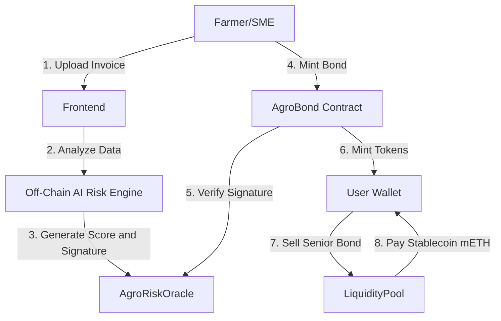

# 🌾 AgroBond: AI-Powered Agricultural RWA Protocol


**AgroBond** is a decentralized protocol that bridges the $4T agricultural financing gap by tokenizing real-world invoices (RWA) into dual-tranche bonds, verified by an AI Risk Engine and settled instantly on the **Mantle Network**.

---

## 🚀 The Problem vs. Solution

| **The Problem** | **The AgroBond Solution** |
|-----------------|---------------------------|
| **Liquidity Gap:** Small farmers wait 90+ days to get paid by big retailers. | **Instant Liquidity:** Farmers mint bonds backed by invoices and sell them instantly to a liquidity pool. |
| **High Barriers:** Traditional factoring is slow, manual, and accessible only to large corps. | **AI Automation:** Our Risk Engine analyzes creditworthiness in seconds, not days. |
| **Risk Opacity:** Lenders don't trust small agricultural assets. | **Dual-Tranche De-Risking:** Bonds are split into **Senior (Safe)** and **Junior (Risk)** tranches to align incentives. |

---

## 🏗 System Architecture



---

## 🔐 Security & Contracts (Mantle Sepolia)

We prioritize security. Our contracts implement **OpenZeppelin** standards, **ReentrancyGuard**, **Circuit Breakers**, and **Anti-Replay Protection**.

| Contract | Address | Description |
|----------|---------|-------------|
| **AgroBond** | `0xeaeaE47163c9dd84345F2975B6817674e79F5799` | ERC-1155 Core, handles minting & splitting (80/20) |
| **LiquidityPool** | `0x9B3788b2DD3172f64976a7c7Cb8b521BF8ddAfCB` | Automated Market Maker for instant cash out (5% fee) |
| **AgroRiskOracle** | `0xcD95a0422C026f342c914293aa207fE6Cad6B8BA` | Verifies AI signatures with nonce & chainId protection |
| **MockMETH** | `0x0f24a4C0Cf713379a11Ea9201Ca306c1b19BE33b` | Testnet payment token (Simulates mETH/USDC) |

---

## ⚡ Key Features

- **🤖 Deterministic AI Scoring:** Algorithms analyze payer reputation (e.g., Walmart, Costco) and invoice metadata to assign a Risk Score (0-100).
- **🛡️ 80/20 Tranche Split:** Every invoice mints **80% Senior Bonds** (sellable immediately) and **20% Junior Bonds** (held as "skin in the game" collateral).
- **⛽ Ultra-Low Cost:** Built on **Mantle**, reducing transaction costs from ~$15 (ETH) to **<$0.01**.
- **💳 Seamless UX:** "Bittensor-style" premium interface with one-click wallet connection and role-based dashboard.

---

## 🛠️ Getting Started

### Prerequisites
- Node.js v18+
- MetaMask Wallet (Connected to Mantle Sepolia)
- Testnet $MNT for gas (Get from [Mantle Faucet](https://faucet.sepolia.mantle.xyz/))

### Installation

1. **Clone the repository**
   ```bash
   git clone https://github.com/your-username/agro-bond.git
   cd agro-bond
   ```

2. **Install dependencies**
   ```bash
   cd frontend
   npm install
   ```

3. **Configure Environment**
   Create a `.env.local` file in the `frontend` directory:
   ```bash
   # Use a dev wallet private key (no real funds!)
   PRIVATE_KEY=your_private_key_here
   ```

4. **Run the App**
   ```bash
   npm run dev
   ```
   Visit `http://localhost:3000`.

---

## 🧪 Testing the Flow (Demo Mode)

1. **Connect Wallet:** Click "Launch App".
2. **Select Scenario:** Choose "Walmart Inc" (Low Risk) or "Tienda Local" (Medium Risk).
3. **Run AI Analysis:** The Oracle will sign a risk assessment.
4. **Issue Bond:** Mint your invoice as an RWA on-chain.
5. **Sell to Pool:** Swap your Senior Bonds for immediate liquidity (Mock mETH).

---

## 📜 License

MIT License. See [LICENSE](LICENSE) for details.

---

*Built with ❤️ for the Mantle Hackathon 2025.*
